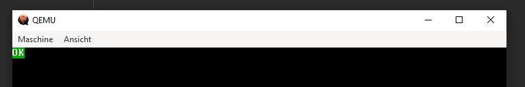

# CannibalOS
*Copyright (c) 2023 - Laura Raine*

 

*CannibalOS as of 26/02/2023*

## Prerequisites
* Docker Desktop
* Python 3.5+
* Git
* QEMU
* A Brain and Common Sense :p
* Windows with PowerShell (for linux look below)

## Attention Linux People
* Instead of chroot_docker.py, run `docker run --rm -it -v "$(pwd)":/root/env cannibalos-env`
* instead of vm_test.py, run `qemu-system-x86_64 -cdrom publish/amd64/iso/cannibal.iso`

## Build Instructions
1. run `py tools\prep_env.py`
2. run `py tools\prep_docker.py`
3. run `py tools\chroot_docker.py`
4. run `make build-amd64` **inside of the container !**
5. run `py tools\vm_test.py` **in a new terminal !**

